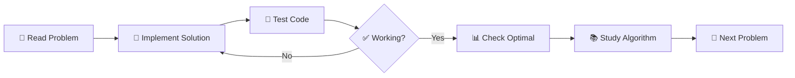

# 🚀 LeetCode Practice Repository

[](https://www.oracle.com/java/)
[](https://leetcode.com/)
[](https://github.com)

> 📚 A comprehensive collection of LeetCode problems and solutions, organized for systematic learning and practice.

## 🎯 Purpose

This repository is my personal study companion for mastering **Data Structures and Algorithms** through LeetCode problems. Each problem is carefully organized with:

- 📝 **Template for practice** - Implement your own solution
- ✨ **Optimal solution** - Learn best approaches and algorithms  
- 📖 **Detailed explanation** - Understand the "why" behind each solution

## 🏗️ Repository Structure

```
leetcode/
├── README.md                              # This file
├── src/
│   ├── problem169_majority_element/       # Problem folder
│   │   ├── MajorityElementMy.java        # 🔨 Your implementation template
│   │   ├── MajorityElement.java          # ✅ Optimal solution
│   │   └── README.md                     # 📚 Algorithm explanation
│   ├── problem189_rotate_array/           # Problem folder
│   │   ├── RotateArrayMy.java            # 🔨 Your implementation template
│   │   ├── RotateArray.java              # ✅ Optimal solution
│   │   └── README.md                     # 📚 Algorithm explanation
│   └── problemXXX_problem_name/          # More problems...
└── ...
```

## 📋 Problem Organization

Each problem follows a **consistent 3-file structure**:

### 🔨 Template File (`*My.java`)
- **Purpose**: Your workspace to implement solutions
- **Features**: 
  - Method stub with TODO comments
  - Comprehensive test cases
  - Ready-to-run main method
- **Naming**: `[ProblemName]My.java`

### ✅ Solution File (`*.java`) 
- **Purpose**: Optimal and alternative solutions
- **Features**:
  - Best time/space complexity approach
  - Alternative algorithms for comparison
  - Detailed comments explaining logic
  - Performance analysis
- **Naming**: `[ProblemName].java`

### 📚 Explanation File (`README.md`)
- **Purpose**: In-depth algorithm breakdown
- **Contents**:
  - Problem description and constraints
  - Step-by-step algorithm walkthrough
  - Time/space complexity analysis
  - Visual examples and edge cases
  - Multiple approach comparisons

## 🎨 Naming Convention

Problems are organized using the format: `problemXXX_problem_name`

| Format | Example | Reason |
|--------|---------|---------|
| `problemXXX` | `problem169` | LeetCode problem number |
| `problem_name` | `majority_element` | Descriptive snake_case name |
| **Full folder** | `problem169_majority_element` | Valid Java package name |

> 💡 **Why this format?** Java package names cannot start with numbers, so `problem` prefix ensures valid package structure.

## 🚀 How to Use This Repository

### 📥 Getting Started

1. **Clone the repository**
   ```bash
   git clone https://github.com/[your-username]/leetcode.git
   cd leetcode
   ```

2. **Choose a problem** (e.g., Majority Element)
   ```bash
   cd src/problem169_majority_element
   ```

3. **Start with your implementation**
   ```bash
   # Edit the template file
   vim MajorityElementMy.java
   
   # Test your solution
   javac *.java && java MajorityElementMy
   ```

4. **Compare with optimal solution**
   ```bash
   java MajorityElement
   ```

5. **Study the algorithm**
   ```bash
   cat README.md
   ```

### 🎯 Practice Workflow



### 💻 Running Code

**From project root:**
```bash
# Compile all files in a problem
javac src/problem169_majority_element/*.java

# Run your implementation
java -cp src problem169_majority_element.MajorityElementMy

# Run optimal solution  
java -cp src problem169_majority_element.MajorityElement
```

**From problem directory:**
```bash
cd src/problem169_majority_element
javac *.java
java MajorityElementMy      # Your solution
java MajorityElement        # Optimal solution
```

## 📊 Progress Tracking

| # | Problem | Difficulty | Status | Key Algorithm |
|---|---------|------------|--------|---------------|
| 169 | [Majority Element](src/problem169_majority_element/) | 🟢 Easy | ✅ | Boyer-Moore Voting |
| 189 | [Rotate Array](src/problem189_rotate_array/) | 🟡 Medium | ✅ | Array Reversal |
| ... | More problems coming... | | | |

## 🎓 Learning Approach

### 📈 Difficulty Progression
1. **🟢 Easy** - Build confidence and basic patterns
2. **🟡 Medium** - Develop problem-solving skills  
3. **🔴 Hard** - Master advanced algorithms

### 🧠 Focus Areas
- **Data Structures**: Arrays, LinkedLists, Trees, Graphs, Hash Tables
- **Algorithms**: Sorting, Searching, Dynamic Programming, Greedy
- **Patterns**: Two Pointers, Sliding Window, Backtracking, DFS/BFS
- **Complexity**: Time/Space optimization techniques

## 🛠️ Development Setup

### Prerequisites
- ☕ **Java 8+** - Primary programming language
- 📝 **Any IDE/Editor** - IntelliJ IDEA, VS Code, Vim, etc.
- 🔧 **Git** - Version control

### Java Package Structure
Each problem includes proper package declarations:
```java
package problem169_majority_element;

public class MajorityElement {
    // Implementation here
}
```

## 🤝 Contributing

This is a personal study repository, but feel free to:
- 🐛 **Report issues** if you find bugs in solutions
- 💡 **Suggest improvements** for explanations or code
- 🌟 **Star the repo** if you find it helpful
- 🍴 **Fork it** to create your own version

## 📚 Resources

- 📖 [LeetCode Official](https://leetcode.com/) - Problem source
- 📊 [Time Complexity Guide](https://www.bigocheatsheet.com/) - Big O reference
- 🎥 [Algorithm Visualization](https://visualgo.net/) - See algorithms in action
- 📝 [Java Documentation](https://docs.oracle.com/en/java/) - Language reference

## 📜 License

This project is open source and available under the [MIT License](LICENSE).

## 🎯 Goals

- [ ] 🎯 Solve 100+ LeetCode problems
- [ ] 📊 Master all major algorithm patterns  
- [ ] 🚀 Achieve consistent problem-solving approach
- [ ] 📝 Create comprehensive study notes
- [ ] 🎓 Prepare for technical interviews

---

<div align="center">

**Happy Coding!** 🚀

Made with ❤️ for learning algorithms and data structures

[⬆ Back to Top](#-leetcode-practice-repository)

</div> 